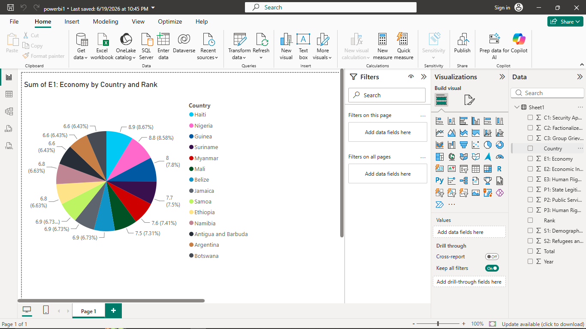

# Module 2: Microsoft Power BI & Business Intelligence Basics

This folder contains my foundational Power BI development projects covering the full data lifecycle from ingestion to interactive visual reporting.

## 📊 Skills & Concepts Covered

### 1. Data Connectivity & Integration
* **Multi-Source Ingestion:** Connected Power BI Desktop to diverse data environments (Excel workbooks and structured datasets).
* **Data Refresh Setup:** Configured data schemas to keep metric models aligned with underlying records.

### 2. ETL & Data Transformation (Power Query)
* **Data Cleansing:** Erased structural anomalies, handled null entries, and utilized 'Remove Duplicates' functions to maintain dataset integrity.
* **Shaping & Optimization:** Executed text structural conversions, modified raw data types, and utilized column grouping for aggregate analytics.
* **Reshaping:** Practiced data structure optimization using Pivot/Unpivot and table vertical combinations (Append/Merge).

### 3. Data Visualization & UI Design
* **Interactive Visualization Engineering:** Structured dynamic pie charts, line graphs, and matrix visuals to analyze economic rankings across global regions.
* **Component Architecture:** Configured interactive dashboard frames using the Visualization Pane, Data Fields, Filter controls, and cross-report slicing.
* **Ecosystem Workflows:** Developed local reporting modules in Power BI Desktop tailored for deployment to the Power BI Service cloud canvas.

## 🖼️ Dashboard Preview

